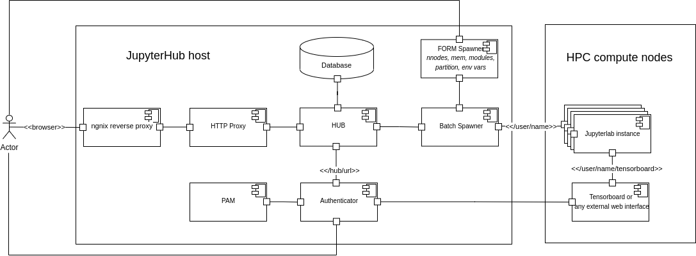

# Introduction

These ansible roles are prepared mainly for HPC platforms where JupyterLab 
instances will be spawned on compute nodes. They were developed for 
deploying JupyterHub on [Jean Zay](http://www.idris.fr/eng/jean-zay/) platform. 
As Jean Zay uses SLURM as batch 
scheduler, these roles install a default SLURM 
[batchspawner](https://github.com/jupyterhub/batchspawner). 
However this can be easily modified by appropriately configuring group and host 
variables. 

Optionally the roles can install node exporter, Prometheus
and Grafana stack for monitoring the JupyterHub host. A basic Grafana dashboard 
is also provided to display the metrics exposed by JupyterHub to Prometheus. 
Besides, Loki and Promtail can also be installed to analyze and visualize logs 
of nginx reverse proxy.

# Prerequisites

- A host that is within the same network as compute nodes of the HPC platform to 
deploy JupyterHub.
- Irrespective of which batch scheduler we are using, we should make sure that 
we should be able to submit jobs from the host where JupyterHub will be deployed
- Currently, only RHEL 8/ CentOS 8 is supported.

# Architecture

The following figure shows the high-level architecture of JupyterHub deployment

The main take-away of this architecture is that every JupyterLab instance 
spawned by JupyterHub is essentially a batch job. Default batchspawner 
installation will not present any spawner form for the user to configure the 
batch job options. However can be done relatively easily following the example 
on the 
[JupyterHub](https://github.com/jupyterhub/jupyterhub/tree/main/examples/spawn-form) 
repo. Just before spawning a 
JupyterLab instance, the user will be presented with a form to configure the 
batch job details like number of nodes, number of GPUs, etc,. The main job step 
of this job will be JupyterLab instance and this it will be submitted to 
scheduler. Once JupyterLab instance starts running, the configurable HTTP proxy 
will add the JupyterLab routes and serve them back to the user.

# Security

All the communications within this architecture are encrypted. All the HTTP 
requests to nginx reverse proxy will be redirected to HTTPS. Similarly, all the 
internal communications between JupyterHub and configurable HTTP proxy are 
encrypted as well using self-signed certificates. If admins chose to deploy 
monitoring stack, node exporter, prometheus and Grafana are also deployed using 
TLS mode and basic authentication (when supported).

Since security is of utmost importance on multi-tenant systems we make sure that 
we will not run any component of this architecture as root user. JupyterHub 
*per se* will be run as a normal user `jupyter` without any extra privileges. 
However, we need a context change when submitting a job as a given user, we will 
add `jupyter` to sudoers list for commands like `sbatch`, `scancel` and `squeue`. 
Strictly speaking, `squeue` does not need sudo rights to check the status of job 
of any user. However, the current implementation of the batchspawner uses `sudo` 
prefix for `squeue` command as well and hence, we will add that command as well 
to the list of commands that `jupyter` user can execute as `sudo`. This is done 
in [create_jupyter_user](roles/setup_jupyterhub/tasks/create_jupyter_user.yml) 
role.

The only component in the entire architecture that faces the public is nginx
reverse proxy. Hence, we need to make sure that we set this up securely. The 
default systemd service file provided by nginx installation is very minimal and 
run the service as root user and then forks the main process to run servers as 
service user nginx. We added a custom systemd service file for nginx that sort 
of "containerises" the service by restricting the access to the file system. 
Also nginx can be used as a normal user and we use capabilities in order to use 
ports less than 1024. More details on the custom systemd file can be found in 
the [template](roles/nginx/templates/nginx.service.j2) where all custom 
directives used are commented.
